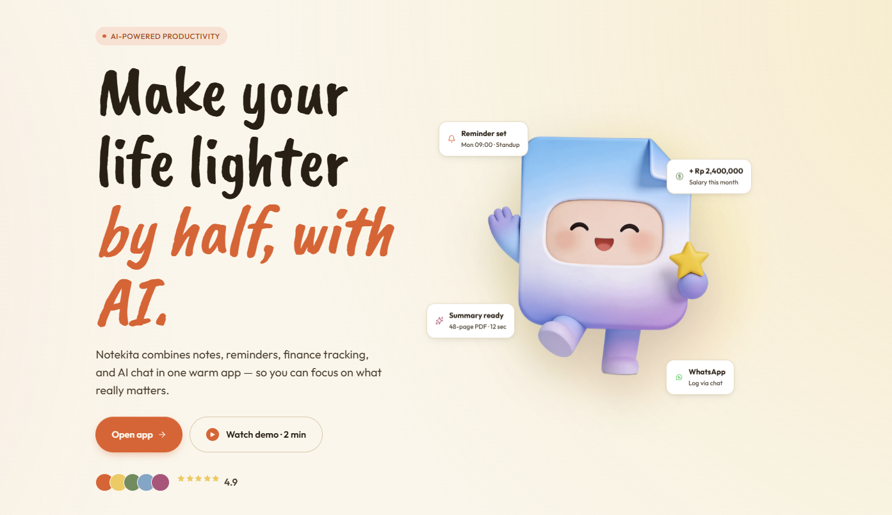

<h2>Hey 👋, I'm <a href="https://yusupsupriyadi.com/">Yusup Supriyadi</a></h2>

I work with passion, have strong enthusiasm for artificial intelligence, and possess advanced skills in AI integration.

<a href="https://yusupsupriyadi.com">Me</a> | <a href="https://www.figma.com/@yusupsupriyadi" target="_blank">Figma</a> | <a href="https://notekita.com" target="_blank">Notekita</a> | <a href="https://www.claudemaster.guru">505 Claude Bundle Skills</a> | <a href="https://marketplace.visualstudio.com/items?itemName=Yusupsupriyadicom.keep-moving">Keep Moving</a>

⚡️ A Few Quick Facts

<ul> 
<li>🍎 Product Maker</li> 
<li>💻 Fullstack Engineer Who Debugs with Coffee as Fuel</li> 
<li>🤖 AI Integration Wizard </li> 
<li>⏰ 4 Years of Transforming Crazy Ideas into Awesome Products</li> 
<li>🎨 Professional Product Maker - Bringing Abstract Concepts to Life!</li> 
</ul>

<h3><a href="https://notekita.com" target="_blank">Notekita.com</a></h3>

  

  <a href="https://notekita.com" target="_blank"><b>Notekita</b></a> — Notes, reminders, finance tracking, and AI chat in one warm app.

